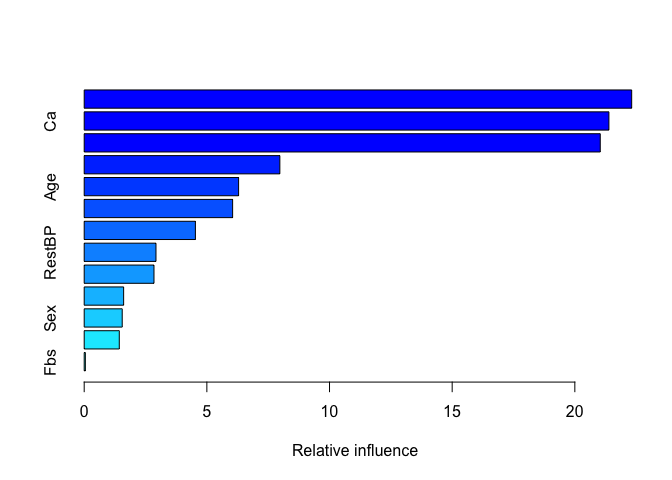

Lab 10 - Trees, Bagging, RF, Boosting, XGBoost
================

# Learning goals

- Perform classification and regression with tree-based methods in R
- Recognize that tree-based methods are capable of capturing
  non-linearities by splitting multiple times on the same variables
- Compare the performance of classification trees, bagging, random
  forests, and boosting for predicting heart disease based on the
  `heart` data.

# Lab description

For this lab we will be working with the `heart` dataset that you can
download from
[here](https://github.com/JSC370/JSC370-2025/blob/main/data/heart.csv)

# Deliverables

Questions 1-5 answered, pdf or html output uploaded to Quercus

### Setup packages

You should install and load `rpart` (trees), `randomForest` (random
forest), `gbm` (gradient boosting) and `xgboost` (extreme gradient
boosting).

``` r
install.packages(c("rpart", "rpart.plot", "randomForest", "gbm", "xgboost"))
```

### Load packages and data

``` r
library(tidyverse)
library(rpart)
library(rpart.plot)
library(randomForest)
library(gbm)
library(xgboost)
library(caret)

heart <- read_csv("https://raw.githubusercontent.com/JSC370/JSC370-2025/refs/heads/main/data/heart/heart.csv") |>
  mutate(
    AHD = 1 * (AHD == "Yes"),
    ChestPain = factor(ChestPain),
    Thal = factor(Thal)
  )

head(heart)
```

    ## # A tibble: 6 × 14
    ##     Age   Sex ChestPain    RestBP  Chol   Fbs RestECG MaxHR ExAng Oldpeak Slope
    ##   <dbl> <dbl> <fct>         <dbl> <dbl> <dbl>   <dbl> <dbl> <dbl>   <dbl> <dbl>
    ## 1    63     1 typical         145   233     1       2   150     0     2.3     3
    ## 2    67     1 asymptomatic    160   286     0       2   108     1     1.5     2
    ## 3    67     1 asymptomatic    120   229     0       2   129     1     2.6     2
    ## 4    37     1 nonanginal      130   250     0       0   187     0     3.5     3
    ## 5    41     0 nontypical      130   204     0       2   172     0     1.4     1
    ## 6    56     1 nontypical      120   236     0       0   178     0     0.8     1
    ## # ℹ 3 more variables: Ca <dbl>, Thal <fct>, AHD <dbl>

------------------------------------------------------------------------

## Question 1: Trees

- Split the `heart` data into training and testing (70-30%)

``` r
set.seed(1008913302)

train <- sample(1:nrow(heart), round(0.7 * nrow(heart)))

heart_train = heart[train,]
heart_test <- heart[-train, ]
```

- Fit a classification tree using rpart, plot the full tree. We are
  trying to predict AHD. Set minsplit = 10, minbucket = 3, and do 10
  cross validations.

``` r
heart_tree <- rpart(
  AHD~., data = heart_train,
  method = "class",
  control = list(minsplit = 10, minbucket = 3, cp = 0, xval = 10)
)
rpart.plot(heart_tree)
```

<!-- -->

- Plot the complexity parameter table for an rpart fit and find the
  optimal cp

``` r
plotcp(heart_tree)
```

<!-- -->

``` r
printcp(heart_tree)
```

    ## 
    ## Classification tree:
    ## rpart(formula = AHD ~ ., data = heart_train, method = "class", 
    ##     control = list(minsplit = 10, minbucket = 3, cp = 0, xval = 10))
    ## 
    ## Variables actually used in tree construction:
    ## [1] Age       Ca        ChestPain ExAng     Oldpeak   Thal     
    ## 
    ## Root node error: 93/212 = 0.43868
    ## 
    ## n= 212 
    ## 
    ##         CP nsplit rel error  xerror     xstd
    ## 1 0.440860      0   1.00000 1.00000 0.077690
    ## 2 0.053763      1   0.55914 0.70968 0.072493
    ## 3 0.043011      3   0.45161 0.53763 0.066465
    ## 4 0.032258      5   0.36559 0.51613 0.065523
    ## 5 0.026882      6   0.33333 0.49462 0.064533
    ## 6 0.010753      8   0.27957 0.52688 0.066000
    ## 7 0.000000      9   0.26882 0.59140 0.068625

- Prune the tree

``` r
optimalcp <- heart_tree$cptable[which.min(heart_tree$cptable[, "xerror"]), "CP"]

optimalcp
```

    ## [1] 0.02688172

``` r
heart_tree_prune<-prune(heart_tree, cp = optimalcp)
rpart.plot(heart_tree_prune)
```

<!-- -->

- Compute the test misclassification error

``` r
heart_pred<-predict(heart_tree_prune, heart_test)
heart_pred <- as.data.frame(heart_pred)
colnames(heart_pred) <- c("No", "Yes")
heart_pred$AHD <- ifelse(heart_pred$Yes>0.5, 1, 0)
```

``` r
confmatrix_table <-table(true=heart_test$AHD, predicted = heart_pred$AHD)
confmatrix_table
```

    ##     predicted
    ## true  0  1
    ##    0 35 10
    ##    1  7 39

``` r
miscla_error <- ((confmatrix_table[1, 2] + confmatrix_table[2, 1])/nrow(heart_test))
miscla_error
```

    ## [1] 0.1868132

- We can see that the misclassification error is around 19%.

- Fit the tree with the optimal complexity parameter to the full data
  (training + testing)

``` r
heart_tree<-rpart(
  AHD~., data = heart,
  method = "class",
  control = list(minsplit = 10, minbucket = 3, cp = 0, xval = 10)
)
```

- Find the Out of Bag (OOB) error for tree

``` r
heart_tree$cptable
```

    ##            CP nsplit rel error    xerror       xstd
    ## 1 0.474820144      0 1.0000000 1.0000000 0.06240124
    ## 2 0.046762590      1 0.5251799 0.5899281 0.05563742
    ## 3 0.021582734      5 0.3381295 0.4244604 0.04958894
    ## 4 0.009592326      6 0.3165468 0.4676259 0.05140544
    ## 5 0.007194245      9 0.2877698 0.5107914 0.05304410
    ## 6 0.003597122     15 0.2446043 0.5611511 0.05475231
    ## 7 0.000000000     19 0.2302158 0.5539568 0.05452096

------------------------------------------------------------------------

## Question 2: Bagging, Random Forest

- Compare the performance of classification trees (above), bagging,
  random forests for predicting heart disease based on the `heart` data.

- Use the training and testing sets from above. Train each of the models
  on the training data and extract the cross-validation (or out-of-bag
  error for bagging and Random forest).

- For bagging use `randomForest` with `mtry` equal to the number of
  features (all other parameters at their default values). Generate the
  variable importance plot using `varImpPlot` and extract variable
  importance from the `randomForest` fitted object using the
  `importance` function.

- For random forests use `randomForest` with the default parameters.
  Generate the variable importance plot using `varImpPlot` and extract
  variable importance from the `randomForest` fitted object using the
  `importance` function.

``` r
heart_bag<-randomForest(as.factor(AHD)~., data = heart_train, mtry = 13, na.action =na.omit)
# oob error rate
sum(heart_bag$err.rate[, 1])
```

    ## [1] 113.8093

``` r
varImpPlot(heart_bag, 
           cex.lab = 1.5,
           cex.ax9s = 2,
           cex = 1.3,
           n.var = 13,
           main = "",
           pch = 10,
           col = "red")
```

<!-- -->

# Question 3: Boosting

- For boosting use `gbm` with `cv.folds=5` to perform 5-fold
  cross-validation, and set `class.stratify.cv` to `AHD` (heart disease
  outcome) so that cross-validation is performed stratifying by `AHD`.
  Plot the cross-validation error as a function of the boosting
  iteration/trees (the `$cv.error` component of the object returned by
  `gbm`) and determine whether additional boosting iterations are
  warranted. If so, run additional iterations with `gbm.more` (use the R
  help to check its syntax). Choose the optimal number of iterations.
  Use the `summary.gbm` function to generate the variable importance
  plot and extract variable importance/influence (`summary.gbm` does
  both). Generate 1D and 2D marginal plots with `gbm.plot` to assess the
  effect of the top three variables and their 2-way interactions.

``` r
heart_boost = gbm(AHD ~., data = heart_train, distribution = "bernoulli",
                  n.trees = 3000, interaction.depth = 1, shrinkage = 0.01, 
                  cv.folds = 5,
                  class.stratify.cv = TRUE)


plot(heart_boost$train.error, cex.lab = 2, cex.axis = 2, col = "red",
     type = "l", lwd = 3, ylim = c(0, 1.5), ylab = "error")

lines(heart_boost$cv.error, col = "steelblue", lwd = 3)
```

<!-- -->

------------------------------------------------------------------------

## Question 4: Gradient Boosting

Evaluate the effect of critical boosting parameters (number of boosting
iterations, shrinkage/learning rate, and tree depth/interaction). In
`gbm` the number of iterations is controlled by `n.trees` (default is
100), the shrinkage/learning rate is controlled by `shrinkage` (default
is 0.001), and interaction depth by `interaction.depth` (default is 1).

Note, boosting can overfit if the number of trees is too large. The
shrinkage parameter controls the rate at which the boosting learns. Very
small $\lambda$ can require using a very large number of trees to
achieve good performance. Finally, interaction depth controls the
interaction order of the boosted model. A value of 1 implies an additive
model, a value of 2 implies a model with up to 2-way interactions, etc.
the default is 1.

- Set the seed and train a boosting classification with `gbm` using
  10-fold cross-validation (`cv.folds=10`) on the training data with
  `n.trees = 5000`, `shrinkage = 0.001`, and `interaction.depth =1`.
  Plot the cross-validation errors as a function of the boosting
  iteration and calculate the test MSE.

``` r
set.seed(301)
heart_boost1 = gbm(AHD ~ ., data = heart[train, ], distribution = "bernoulli", n.trees = 5000, interaction.depth = 1, shrinkage = 0.001, cv.folds = 10, class.stratify.cv = TRUE)

summary(heart_boost1)
```

<!-- -->

    ##                 var      rel.inf
    ## Thal           Thal 26.268605201
    ## Ca               Ca 25.550942110
    ## ChestPain ChestPain 22.717407859
    ## Oldpeak     Oldpeak  7.389725204
    ## Chol           Chol  3.905965824
    ## ExAng         ExAng  3.807056831
    ## MaxHR         MaxHR  3.712628545
    ## Age             Age  1.965570017
    ## RestBP       RestBP  1.725243860
    ## Slope         Slope  1.414340207
    ## RestECG     RestECG  0.785535119
    ## Sex             Sex  0.750990551
    ## Fbs             Fbs  0.005988673

``` r
#calculate MSE
min(heart_boost1$cv.error)
```

    ## [1] 0.8731371

``` r
yhat_boost<-predict(heart_boost1, newdata=heart_test, n.trees = 5000)
mean((yhat_boost - heart_test$AHD)^2)
```

    ## [1] 2.276918

``` r
plot(heart_boost1$train.error, cex.lab = 2, cex.axis = 2, col = "red",
     type = "l", lwd = 3, ylim = c(0, 1.5), ylab = "error")

lines(heart_boost1$cv.error, col = "steelblue", lwd = 3)
```

<!-- -->

- Repeat the above using the same seed and `n.trees=5000` with the
  following 3 additional combination of parameters:

1)  `shrinkage = 0.001`, `interaction.depth = 2`;
2)  `shrinkage = 0.01`, `interaction.depth = 1`;
3)  `shrinkage = 0.01`, `interaction.depth = 2`.

``` r
set.seed(301)
heart_boost_a = gbm(AHD ~ ., data = heart[train, ], distribution = "bernoulli", n.trees = 5000, interaction.depth = 2, shrinkage = 0.001, cv.folds = 10, class.stratify.cv = TRUE)

summary(heart_boost_a)
```

<!-- -->

    ##                 var     rel.inf
    ## Thal           Thal 22.31735280
    ## Ca               Ca 21.38900920
    ## ChestPain ChestPain 21.03592408
    ## Oldpeak     Oldpeak  7.97546976
    ## Age             Age  6.29389638
    ## Chol           Chol  6.05044701
    ## MaxHR         MaxHR  4.53300245
    ## RestBP       RestBP  2.92610672
    ## ExAng         ExAng  2.84484440
    ## Slope         Slope  1.60765485
    ## Sex             Sex  1.54955981
    ## RestECG     RestECG  1.43010389
    ## Fbs             Fbs  0.04662865

``` r
#calculate MSE
min(heart_boost_a$cv.error)
```

    ## [1] 0.8688264

``` r
yhat_boost<-predict(heart_boost_a, newdata=heart_test, n.trees = 5000)
mean((yhat_boost - heart_test$AHD)^2)
```

    ## [1] 3.350795

``` r
plot(heart_boost_a$train.error, cex.lab = 2, cex.axis = 2, col = "red",
     type = "l", lwd = 3, ylim = c(0, 1.5), ylab = "error")

lines(heart_boost_a$cv.error, col = "steelblue", lwd = 3)
```

<!-- -->

``` r
set.seed(301)
heart_boost_b = gbm(AHD ~ ., data = heart[train, ], distribution = "bernoulli", n.trees = 5000, interaction.depth = 1, shrinkage = 0.01, cv.folds = 10, class.stratify.cv = TRUE)

summary(heart_boost_b)
```

<!-- -->

    ##                 var    rel.inf
    ## Thal           Thal 37.1014566
    ## Ca               Ca 12.1732813
    ## ChestPain ChestPain 12.1351951
    ## Chol           Chol  7.8176160
    ## RestBP       RestBP  7.0708002
    ## Oldpeak     Oldpeak  6.6748933
    ## MaxHR         MaxHR  5.8638976
    ## Age             Age  5.7448082
    ## ExAng         ExAng  1.8075295
    ## Slope         Slope  1.3559259
    ## Sex             Sex  1.1280843
    ## RestECG     RestECG  0.8955533
    ## Fbs             Fbs  0.2309587

``` r
#calculate MSE
min(heart_boost_b$cv.error)
```

    ## [1] 0.8709238

``` r
yhat_boost2<-predict(heart_boost_b, newdata=heart_test, n.trees = 5000)
mean((yhat_boost2 - heart_test$AHD)^2)
```

    ## [1] 9.031651

``` r
plot(heart_boost_b$train.error, cex.lab = 2, cex.axis = 2, col = "red",
     type = "l", lwd = 3, ylim = c(0, 1.5), ylab = "error")

lines(heart_boost_b$cv.error, col = "steelblue", lwd = 3)
```

<!-- -->

``` r
set.seed(301)
heart_boost_c = gbm(AHD ~ ., data = heart[train, ], distribution = "bernoulli", n.trees = 5000, interaction.depth = 2, shrinkage = 0.01, cv.folds = 10, class.stratify.cv = TRUE)

summary(heart_boost_c)
```

<!-- -->

    ##                 var    rel.inf
    ## Thal           Thal 43.0472249
    ## ChestPain ChestPain 10.3382505
    ## Ca               Ca  8.6157573
    ## Age             Age  7.8676968
    ## Chol           Chol  7.3395819
    ## Oldpeak     Oldpeak  6.4873824
    ## MaxHR         MaxHR  5.8116423
    ## RestBP       RestBP  5.3488465
    ## Sex             Sex  1.4118945
    ## ExAng         ExAng  1.3190497
    ## RestECG     RestECG  1.2013255
    ## Slope         Slope  0.9166492
    ## Fbs             Fbs  0.2946983

``` r
#calculate MSE
min(heart_boost_c$cv.error)
```

    ## [1] 0.8715956

``` r
yhat_boost3<-predict(heart_boost_c, newdata=heart_test, n.trees = 5000)
mean((yhat_boost3 - heart_test$AHD)^2)
```

    ## [1] 16.3954

``` r
plot(heart_boost_c$train.error, cex.lab = 2, cex.axis = 2, col = "red",
     type = "l", lwd = 3, ylim = c(0, 1.5), ylab = "error")

lines(heart_boost_c$cv.error, col = "steelblue", lwd = 3)
```

<!-- -->

## Question 5: Extreme Gradient Boosting

Train a XGBoost model with `xgboost` and perform a grid search for
tuning the number of trees and the maximum depth of the tree. Also
perform 10-fold cross-validation and determine the variable importance.
Finally, compute the test MSE.

Tuning parameters - max_depth: tree depth, larger makes model more
complex and potentially overfit - nrounds: number of boosting
iterations - eta: learning rate (shrinkage) - gamma: minimum loss
reduction required to make a further partition on a leaf node of the
tree. The larger gamma is, the more conservative the algorithm will be
(simpler model) - min_child_weight: controls the minimum number of
samples in a leaf node before further splitting - colsample_bytree:
controls the fraction of features (variables) used to build each tree.
Default is 1 which is all features

``` r
train_control = trainControl(method = "cv", number = 10, search ="grid")

tune_grid<-  expand.grid(max_depth = c(1, 3, 5, 7), 
                        nrounds = (1:10)*50, 
                        eta = c(0.01,0.1,0.3), 
                        gamma = 0, 
                        subsample = 1,
                        min_child_weight = 1,
                        colsample_bytree = 0.6 
                        )

heart_xgb<-caret::train(
  AHD ~.,, 
  data = heart_train,
  method="xgbTree",
trControl = train_control, 
tuneGrid = tune_grid, 
na.action = na.exclude,
verbosity = 0
)
```

    ## Warning in train.default(x, y, weights = w, ...): You are trying to do
    ## regression and your outcome only has two possible values Are you trying to do
    ## classification? If so, use a 2 level factor as your outcome column.

``` r
varimp <- varImp(heart_xgb, scale = FALSE)
plot(varimp)
```

<!-- -->

``` r
yhat_xgb<-predict(heart_xgb, newdata=heart_test)
mean((yhat_xgb-heart_test$AHD)^2)
```

    ## Warning in yhat_xgb - heart_test$AHD: longer object length is not a multiple of
    ## shorter object length

    ## [1] 0.2211886

``` r
caret::RMSE(heart_test$AHD, yhat_xgb)
```

    ## Warning in pred - obs: longer object length is not a multiple of shorter object
    ## length

    ## [1] 0.4703069

- Compare the the performance of the different models and summarize

- The XGBoost model outperforms the GBM model. It outperforms the GBM
  model for all combinations/tunings of parameters, because the XGBoost
  model achieves a much lower MSE (0.221) and RMSE (0.47), indicating
  better predictive accuracy. Though, there still can be improvements in
  all models.
